# ☁️ AWS Serverless Inventory System

## 🏆 Pencapaian

Seleksi Internal LKS Cloud Computing SMK Negeri 4 Bandung 2026
Modul: Serverless Application

---

## 📋 Overview

Membangun sistem inventaris berbasis serverless di AWS.
Seluruh konfigurasi infrastruktur dilakukan secara mandiri
tanpa perlu mengelola server sama sekali.

Source code Lambda:
→ github.com/ZeitakuXIV/lksbdg-serverless

---

## 🏗️ Arsitektur

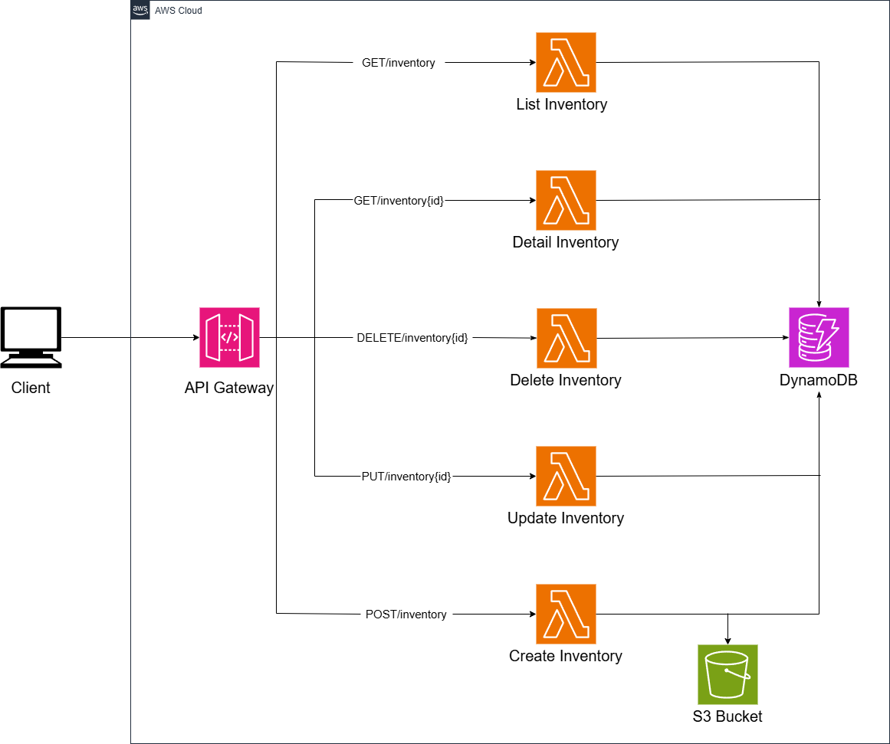

---

## 📁 Struktur Repository

```
aws-serverless-inventory/
├── README.md
├── docs/
│   ├── api-reference.md
│   └── screenshots/
│       ├── architecture.png
│       ├── iam/
│       ├── dynamodb/
│       ├── s3/
│       ├── lambda/
│       ├── api-gateway/
│       └── testing/
└── policies/
    └── s3-bucket-policy.json
```

---

## ⚙️ Yang Dikonfigurasi

✅ IAM Role + Policy (AmazonDynamoDBFullAccess, AmazonS3FullAccess)
✅ DynamoDB Table (inventory, partition key: inventoryID)
✅ S3 Bucket + Public Bucket Policy
✅ Lambda Functions (5 functions: CRUD + List)
✅ Environment Variables di setiap Lambda
✅ API Gateway REST API + CORS
✅ Lambda Proxy Integration
✅ Deploy API ke stage "dev"
✅ Testing via Postman

---

## 🛠️ Tech Stack


---

## 📸 Screenshots

### IAM Role - Permissions & Trust Policy

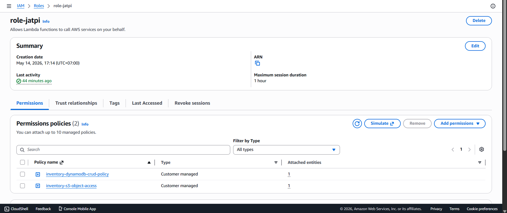

### DynamoDB - Table Overview

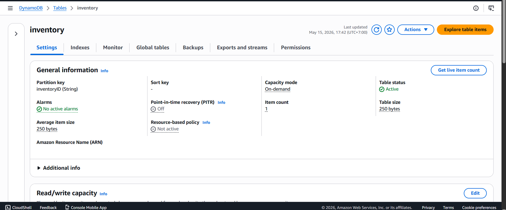

### S3 Bucket - Bucket & Policy

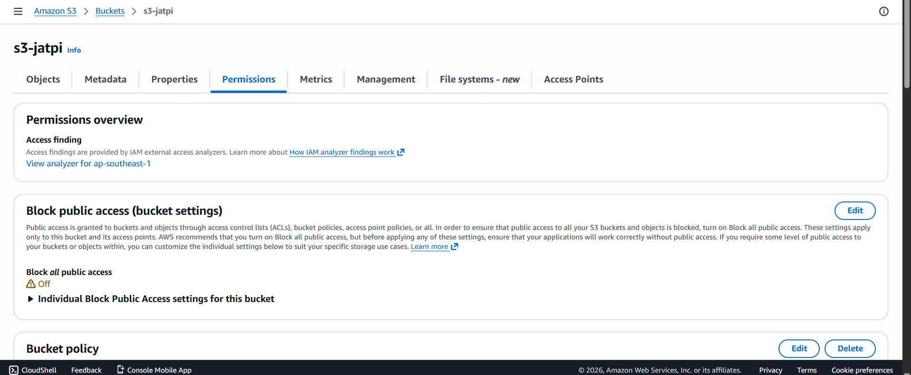

### Lambda Functions - All 5 Functions

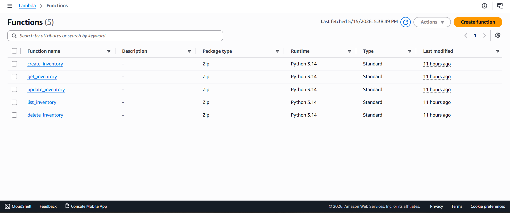

### API Gateway - Resources & Methods

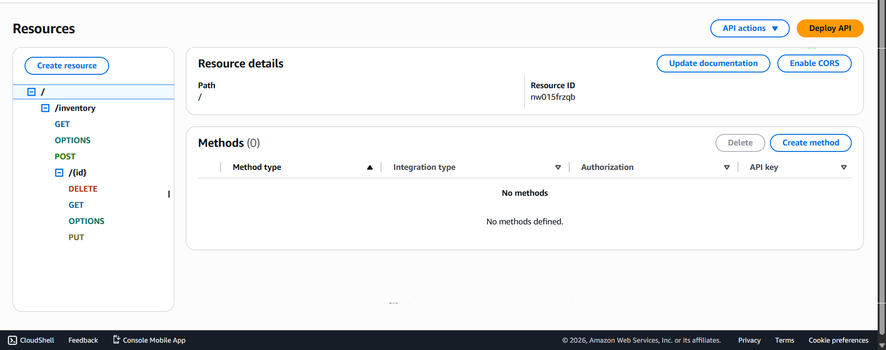

### Testing via Postman

#### Postman Create Data

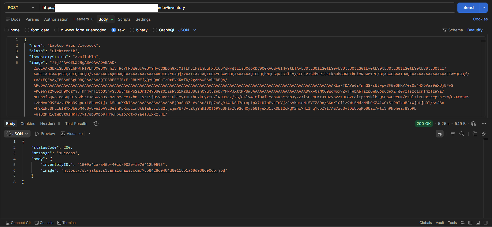

#### Postman List Data

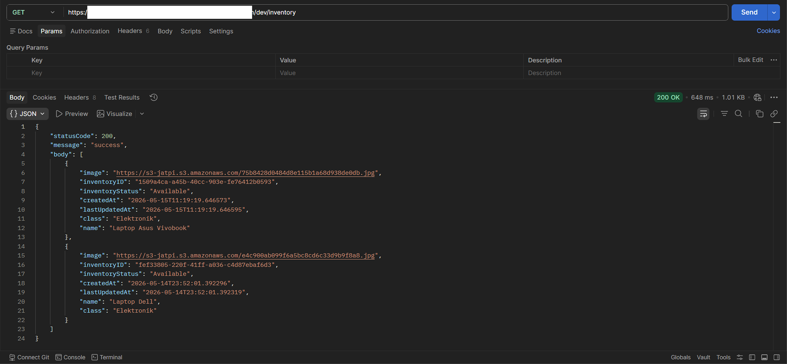

#### Postman Read Data

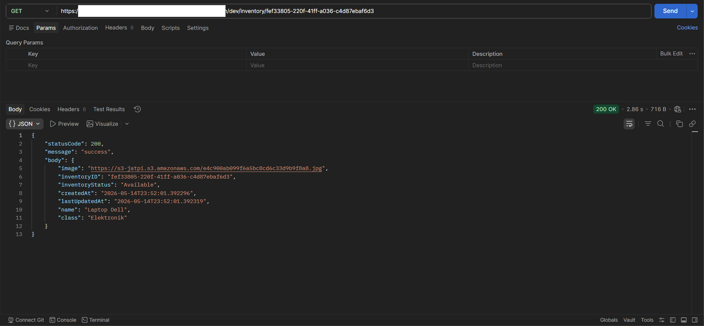

#### Postman Update Data

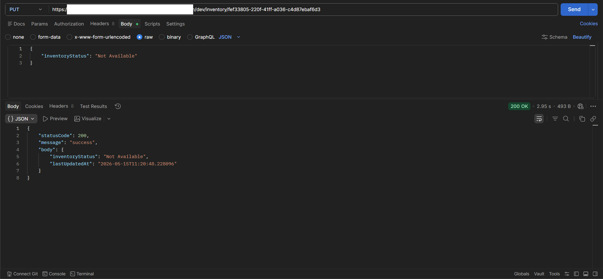

#### Postman Delete Data

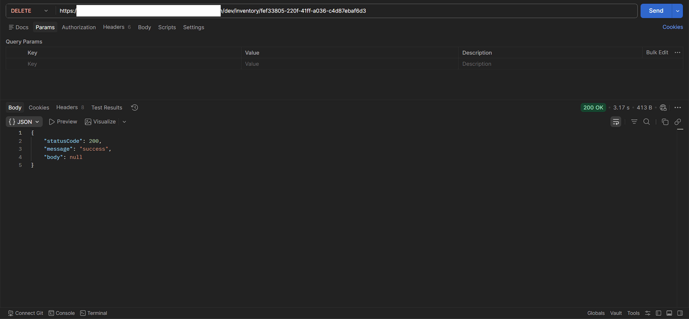

---

<!-- ## 📝 Detail Konfigurasi

→ Lihat [docs/api-reference.md](docs/api-reference.md)

--- -->

## 📚 Referensi

→ [AWS Lambda](https://docs.aws.amazon.com/lambda/)  
→ [Amazon DynamoDB](https://docs.aws.amazon.com/dynamodb/)  
→ [Amazon API Gateway](https://docs.aws.amazon.com/apigateway/)  
→ [Amazon S3](https://docs.aws.amazon.com/s3/)  
→ [Source Code Lambda](https://github.com/ZeitakuXIV/lksbdg-serverless)
